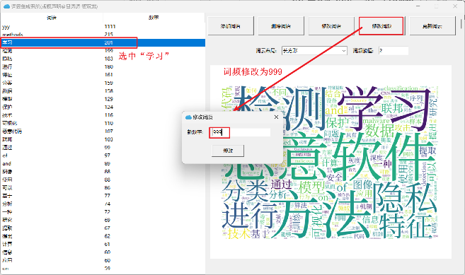
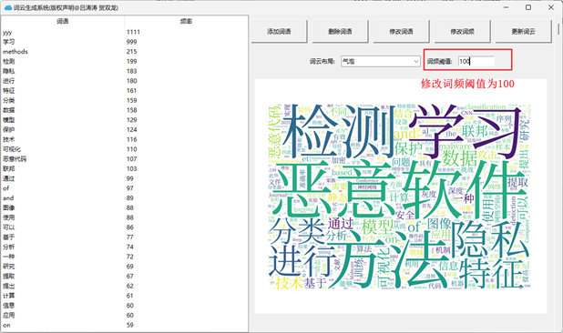

# WordCloud 词云生成系统

# 版权声明

## 作者信息

- **姓名**: Lv Taotao
- **邮箱**: taotao.lyu@e.gzhu.edu.cn

##

本软件版权和最终解释权归上述作者所有

如有任何问题或需要进一步的信息，请通过以上提供的联系方式与我们取得联系

# 功能简介
一个图形界面交互的词云生成系统，该系统能够从指定的 Word 文档目录中读取文档内容，进行分词并提供人工干预功能，生成符合要求的词云图像

### 提供以下功能
1. **添加词语**：
   - 点击“添加词语”按钮，输入新词语及相应的频率，然后确认
   - 新增的词语会立即反映在词语频率列表中，并按照频率排序

2. **删除词语**：
   - 用户可以从列表中选择并删除不需要的词语

3. **修改词语**：
   - 用户可以更改词语的内容或其关联的频率

4. **修改词频**：
   - 更改词语的频率后，列表将根据新的频率值重新排序
5. **词云布局调整**：
   - 用户可随时更换词云的布局样式，以获得最满意的视觉效果

6. **词频阈值修改**：
   - 调整词频阈值，控制最终词云中词语的数量。

7. **更新词云**：
   - 完成所有修改后，点击“更新词云”按钮，使所有更改生效，并更新词云图像

# 使用指南
## 1.1 显示初始化界面

- 点击`Setup.bat`会自动检查并安装必要的依赖，在自动生成`Cloud.exe`可执行程序
- 如果您不想安装所需依赖或者正在进行某些非常重要的工作，请谨慎执行`Setup.bat`
- 如果您不想安装所需依赖但还想使用词云生成系统，可以使用我们提供的`Cloud.exe`可执行程序

- 自动生成的`Cloud.exe`可执行程序在本目录下
- 初次使用时,加载会有点慢

- 如果在执行`Setup.bat`出现某些错误,请耐心阅读错误提示,并根据错误提示进行所需操作操作完成后，再次执行`Setup.bat`

- 如果您的电脑安装了`Anaconda`，可能需要执行`conda remove pathlib`，也可能不需要,但这会改变您原有的系统，如果不想更改,可以使用我们提供的`Cloud.exe`可执行程序

- 如果您想用`python`解释器直接执行`Cloud.py`,可能会因为路径错误无法执行,如果您特别想这样做，请阅读源码修改部分路径

- 不推荐使用`python`解释器直接执行`Cloud.py`，特别推荐使用我们提供的`Cloud.exe`可执行程序,其次是自动生成`Cloud.exe`可执行程序

- 本仓库提供一些测试文本在`DataBase`中,用户可以自定义数据

## 1.1 显示初始化界面

当程序启动时，用户将看到如下的初始化界面，它包含了以下组件：

- **文档目录**：显示当前选择的文件夹路径
- **“浏览”按钮**：允许用户选择包含`.doc`或`.docx`文件的本地**文件夹**。
- **词频阈值输入框**：用户可以设置或调整词频的最低出现次数
- **词云布局选择框**：提供多种词云布局样式供用户选择
- **“生成词云”按钮**：点击此按钮开始根据设定参数生成词云
- **“点击“浏览”按钮**：用户可以选择一个本地文件夹，该文件夹中应包含至少一个`.doc`或`.docx`类型的文件。选定文件夹后，用户可以根据需要调整词频阈值，并选择喜欢的词云布局。一切准备就绪后，用户只需点击“生成词云”按钮，程序就会根据设定的参数开始处理并生成词云图像

## 1.2 显示主界面

一旦词云生成完成，用户将进入主界面，这里提供了对词云进一步定制的功能：

- **添加词语按钮**：点击“添加词语”按钮，输入待添加词语及频率（图1），可以更新词频列表及排序（图2）

- **删除词语按钮**：为用户提供从词库中移除任意词语的能力

- **修改词语按钮**：让用户能够编辑现有词语的信息

- **修改词频按钮**：选择任意词语修改其频率，并对列表重新排序

- **词云布局调整功能**：让用户能选择喜欢的样式，调整已有的云图

- **词频阈值修改功能**：让用户能修改词频阈值的大小，调整词云上显示的词语的数量

- **更新词云功能**：在对词语列表或云图调整完之后，点击“更新词云”，即可更新词云图，实现所有更改后的效果

- **生成云图预览图**：实时显示当前配置下的词云效果

## 1.3 生成词云图片保存至本地

程序默认会在`WordCloud.exe`所在的同一目录下保存生成的词云图片，方便用户查找和**分享**

